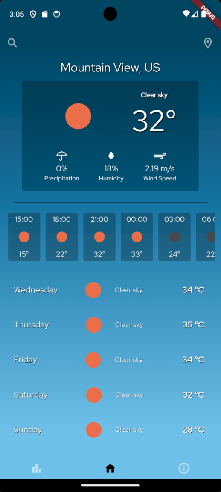
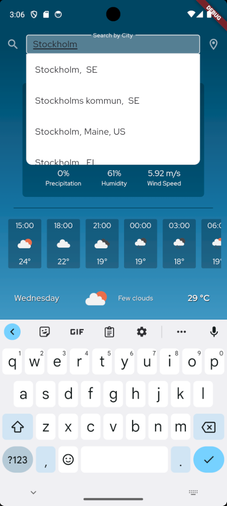
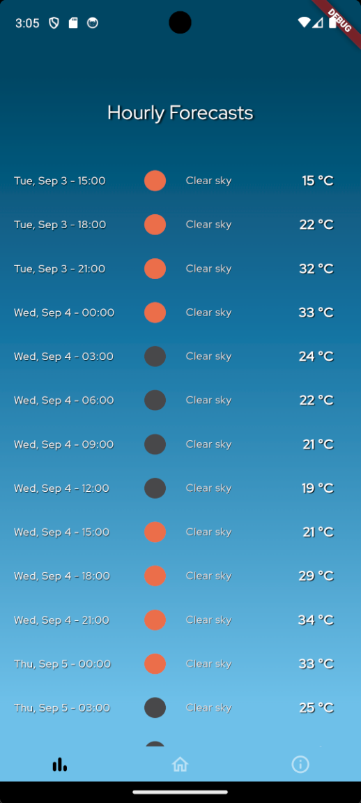

# weather_app

A Flutter Weather-App project.

I've createad a weather app with the free 5-day, 3-hours weather forecast from 'https://openweathermap.org/'.

Fetches weather from device location, possible to also search and view other locations weather.

## To Run

Simply run the project, preferably on a mobile device (VM, emulator).
 
Hopefully the API-link is still up and running. 

### Images:

